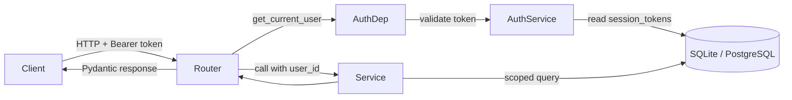
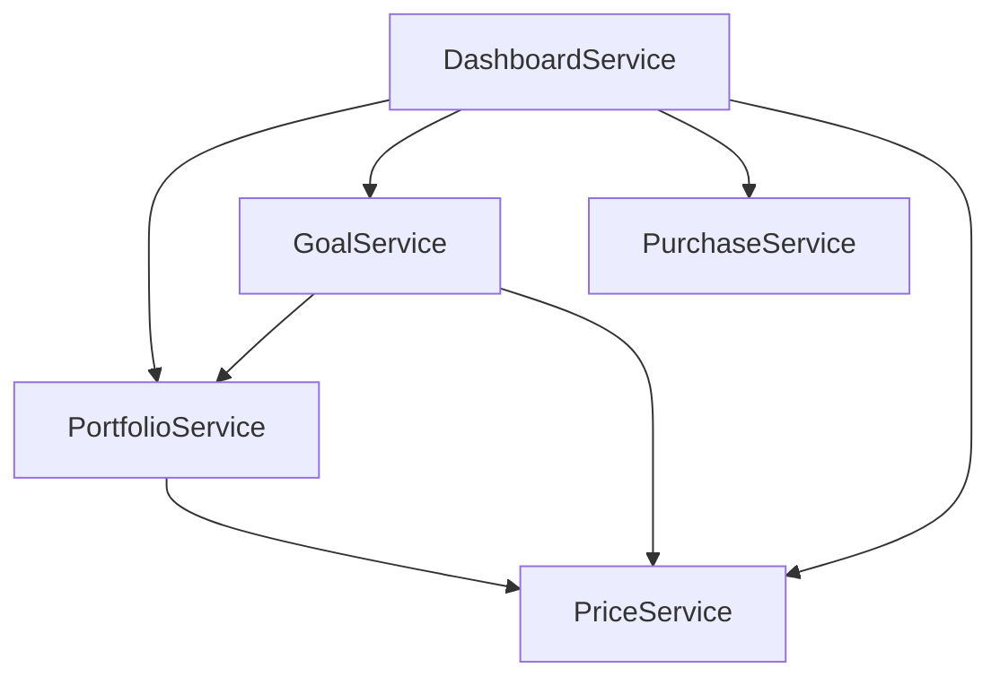
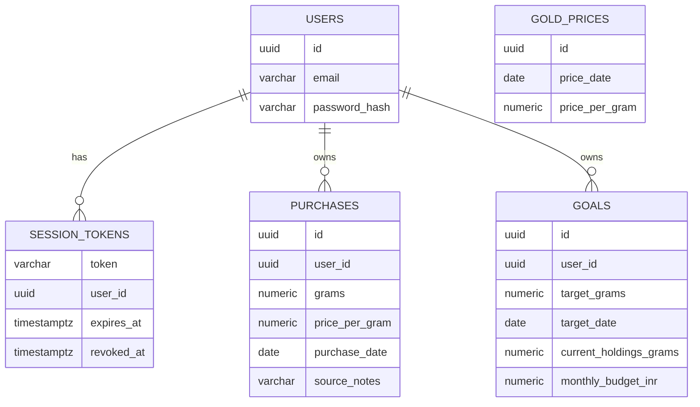

# Design Document

## Overview

GoldGoal Core (Phase 1) is a multi-user web application backend that lets a user register, log in, record physical gold purchases, view portfolio analytics, define ownership goals, and see progress against those goals — all denominated in INR and grams. This document defines the service boundaries, data model, algorithms, and validation surface required to satisfy the requirements. ML forecasting, automated price ingestion, notifications, and cloud deployment are explicitly out of scope for this phase and are handled by later phases.

The design keeps the new code in a fresh `goldgoal/` Python package that sits next to the existing `ml_models/` and `dashboard/` packages. That way the existing gold price analysis project remains fully functional while Phase 1 introduces a clean, self-contained REST backend. The existing `data/gold.csv` is reused as the seed for the `Gold_Price` table, so the app has real INR prices to compute `Current_Portfolio_Value` and `Required_Monthly_Investment` on day one.

### Design Goals

- **Correctness first**: portfolio math and goal math must be exact within rounding tolerance; monetary values use `Decimal`, not `float`.
- **Session-based auth with server-side revocation**: logout must invalidate a token immediately (Req 2.6), which rules out stateless JWT without a blocklist. Opaque database-backed session tokens satisfy this simply.
- **Strict per-user data isolation**: every service query is filtered by the authenticated `user_id` on the server side; the client cannot override ownership (Req 3.6, 10.x).
- **Small, testable pure functions**: the analytics and goal-progress calculations are pure functions of Purchase/Goal/Price rows, which makes property-based testing tractable.

### Stack

| Layer | Choice | Rationale |
|---|---|---|
| Web framework | FastAPI | Aligns with `plan.md`; native `async` support; Pydantic-based validation matches the field-level error requirements in Reqs 1, 3, 6. |
| ORM | SQLAlchemy 2.0 (declarative) | Mature, works with SQLite (dev) and PostgreSQL (prod) without code changes. |
| Migrations | Alembic | Standard companion to SQLAlchemy; supports the fresh schema this phase introduces. |
| Validation | Pydantic v2 | Field-level errors map directly to the "validation error identifying the X field" contract in the requirements. |
| Password hashing | `passlib[bcrypt]` | Well-audited, salted, slow-by-design; satisfies Req 1.2. |
| Session tokens | `secrets.token_urlsafe(32)` | Opaque 256-bit tokens stored in DB; revocable at logout (Req 2.6). |
| Money type | `decimal.Decimal` + SQLAlchemy `Numeric(18, 4)` for grams and `Numeric(18, 2)` for INR | Avoids IEEE-754 drift on sums; matches the rounding contract in Req 5.7. |
| DB (dev) | SQLite | Zero-setup local run; supported by SQLAlchemy identically to PostgreSQL for this schema. |
| DB (prod) | PostgreSQL | From `plan.md`; unique constraints, indexes, and transactions all work identically. |
| Testing | `pytest` + `hypothesis` | `hypothesis` is the mature property-based testing library for Python; already implicitly compatible with Pydantic value ranges. |

### Reused vs. new code

- **Reused**: `data/gold.csv` seeds the `Gold_Price` table on first startup via a small loader that reuses the parsing conventions in `ml_models/data_loader.py::load_gold` (date parsing, numeric cleaning). No import dependency on `ml_models` — the seed script has its own tiny CSV reader to keep the packages decoupled.
- **New**: everything under `goldgoal/` (models, schemas, services, api, security, db).
- **Untouched**: `streamlit_app_final.py`, `dashboard/ml_dashboard.py`, `ml_models/*`. Phase 1 does not modify or depend on the existing ML pipeline.

## Architecture

GoldGoal Core is a layered HTTP service. Each service in the requirements (Auth, Purchase, Portfolio, Goal, Price, Dashboard) is one module under `goldgoal/services/` with a matching router under `goldgoal/api/`. Services never talk to each other over HTTP; they call each other in-process through function calls to keep the dashboard aggregation fast (Req 11.1).

### Package layout

```
goldgoal/
  __init__.py
  main.py                 # FastAPI app factory, router registration, startup seed
  db/
    __init__.py
    session.py            # SQLAlchemy engine + SessionLocal + get_db() dependency
    seed.py               # Loads data/gold.csv into gold_prices on first startup
  models/                 # SQLAlchemy ORM models
    __init__.py
    user.py
    session_token.py
    purchase.py
    goal.py
    gold_price.py
  schemas/                # Pydantic request/response models
    __init__.py
    auth.py
    purchase.py
    goal.py
    portfolio.py
    price.py
    dashboard.py
  services/               # Pure-ish business logic (no HTTP concerns)
    __init__.py
    auth_service.py
    purchase_service.py
    portfolio_service.py
    goal_service.py
    price_service.py
    dashboard_service.py
  api/                    # FastAPI routers (thin translation layer)
    __init__.py
    deps.py               # get_current_user dependency
    auth.py
    purchases.py
    goals.py
    portfolio.py
    price.py
    dashboard.py
  security.py             # hash_password, verify_password, new_session_token
  errors.py               # Domain exceptions + FastAPI handlers
tests/
  unit/
  properties/             # Hypothesis property tests
```

### Request flow



The `get_current_user` FastAPI dependency is the single gate for every authenticated endpoint. It reads the `Authorization: Bearer <token>` header, calls `AuthService.validate_session`, and returns a `User` object that services then use to scope every query. This is the mechanism that enforces Reqs 10.1–10.5.

### Service composition



`DashboardService` composes the other four services in a single request. Because everything runs in-process against the same `Session`, the composed response is a coherent snapshot: `total_grams` used inside `PortfolioService` and `current_grams` used inside `GoalService` both read from the same transaction, satisfying Req 9.5.

### Startup sequence

1. Create tables if they do not exist (Alembic in prod; `Base.metadata.create_all` for local dev).
2. If `gold_prices` is empty, run `db/seed.py` to load `data/gold.csv` — parse dates, coerce `Price` to `Decimal`, insert one row per date. This gives the Price_Service real values on first launch.
3. Register routers, mount the app.

### Deployment shape (Phase 1)

Single-process ASGI (uvicorn). No load balancer, no cache, no external queue. This is sufficient for Req 11's 1000-record dataset under nominal single-instance load. Phase 4 (cloud deployment) is out of scope here.

## Components and Interfaces

Each service exposes a small typed Python API. HTTP routers translate between JSON and these Python types; the services themselves are unit-testable without spinning up FastAPI.

### Auth_Service (`services/auth_service.py`)

Responsible for registration, login, session validation, and logout (Reqs 1, 2, 10.5).

```python
def register(db: Session, email: str, password: str) -> User:
    """Reqs 1.1, 1.3, 1.4, 1.5. Returns the created User (never the hash)."""

def login(db: Session, email: str, password: str) -> SessionToken:
    """Reqs 2.1, 2.2, 2.3, 2.7. On failure, raises AuthenticationError with a
    single generic message regardless of whether the email exists."""

def validate_session(db: Session, token: str) -> User:
    """Reqs 2.4, 2.5. Raises UnauthorizedError on missing/expired/revoked."""

def logout(db: Session, token: str) -> None:
    """Req 2.6. Sets revoked_at on the SessionToken row."""
```

**Password hashing (Req 1.2, Req 2.3)**: `security.hash_password(password)` uses `passlib.hash.bcrypt` with a per-user random salt (bcrypt embeds the salt in the resulting hash). `security.verify_password(password, hash)` returns a bool. Neither the plain password nor the hash is ever included in a response schema (Req 1.6 — enforced by not putting `password_hash` on any Pydantic response model).

**Session tokens (Reqs 2.1, 2.6, 2.7)**: `security.new_session_token()` returns a 43-char URL-safe random string from `secrets.token_urlsafe(32)`. A row is inserted into `session_tokens` with `expires_at = now + timedelta(hours=24)` and `revoked_at = NULL`. `validate_session` rejects if `revoked_at IS NOT NULL` or `expires_at < now()`. Logout sets `revoked_at = now()` so any subsequent request with the same token fails validation.

**Uniform login failure (Req 2.2, 2.3)**: `login` catches "no user with this email" and "wrong password" and raises the same `AuthenticationError("Invalid email or password")`. The email-existence branch never surfaces to the client.

### Purchase_Service (`services/purchase_service.py`)

Reqs 3, 4, 10.1.

```python
def create_purchase(db, user_id: UUID, grams: Decimal, price_per_gram: Decimal,
                    purchase_date: date, source_notes: str | None) -> Purchase
def list_purchases(db, user_id: UUID) -> list[Purchase]
def get_purchase(db, user_id: UUID, purchase_id: UUID) -> Purchase
def update_purchase(db, user_id: UUID, purchase_id: UUID, **fields) -> Purchase
def delete_purchase(db, user_id: UUID, purchase_id: UUID) -> None
```

**Ownership scoping (Req 3.6, 10.1)**: every query is filtered by `Purchase.user_id == user_id`. The `user_id` is taken from the authenticated session, never from the request body. Update/delete for a record owned by another user returns a `NotFoundError` — indistinguishable from "does not exist" to prevent enumeration (Req 4.4, 10 property).

**Validation (Reqs 3.2–3.5, 4.5)**: Pydantic `PurchaseCreate`/`PurchaseUpdate` schemas enforce `grams > 0`, `price_per_gram >= 0`, `purchase_date <= today`, `len(source_notes) <= 500`. Field-level Pydantic errors map to the "validation error identifying the X field" contract. `purchase_date` is checked against `date.today()` in the service layer (not the schema) so the "current server date" is the app server's clock at request time.

**Ordering (Req 4.1)**: `list_purchases` returns `ORDER BY purchase_date DESC, created_at DESC`.

### Portfolio_Service (`services/portfolio_service.py`)

Req 5, 10.3.

```python
@dataclass
class PortfolioSummary:
    total_grams: Decimal            # 4 dp
    total_invested: Decimal         # 2 dp INR
    average_purchase_price: Decimal | None   # 2 dp INR/g, None if total_grams == 0
    current_portfolio_value: Decimal | None  # 2 dp INR, None if no gold_price
    price_available: bool

def summary(db, user_id: UUID) -> PortfolioSummary
```

**Algorithm**:
1. `SELECT SUM(grams), SUM(grams * price_per_gram) FROM purchases WHERE user_id = :uid` — one round trip.
2. If the sums are `NULL` (no rows), `total_grams = 0`, `total_invested = 0`, `average_purchase_price = None` (Req 5.4).
3. Else `average_purchase_price = total_invested / total_grams`.
4. Ask `PriceService.latest()`. If it returns `None`, set `current_portfolio_value = None`, `price_available = False` (Req 5.6). Else `current_portfolio_value = total_grams * price.price_per_gram`.
5. Round using `Decimal.quantize(Decimal("0.0001"))` for grams and `Decimal.quantize(Decimal("0.01"), rounding=ROUND_HALF_UP)` for INR (Req 5.7).

Rounding is applied only at the response boundary. Internal arithmetic uses full-precision `Decimal` so `total_invested == average_purchase_price * total_grams` holds within rounding tolerance (property in Req 5).

### Goal_Service (`services/goal_service.py`)

Reqs 6, 7, 10.2.

```python
def create_goal(db, user_id, target_grams, target_date, current_holdings_grams,
                monthly_budget_inr) -> Goal
def list_goals(db, user_id) -> list[Goal]
def get_goal(db, user_id, goal_id) -> Goal
def update_goal(db, user_id, goal_id, **fields) -> Goal
def delete_goal(db, user_id, goal_id) -> None
def progress(db, user_id, goal_id) -> GoalProgress
```

**GoalProgress** dataclass (fields align with Req 7.1–7.8):

```python
@dataclass
class GoalProgress:
    goal_id: UUID
    current_grams: Decimal
    progress_percent: Decimal            # 0..100
    remaining_grams: Decimal             # >= 0
    required_monthly_investment_inr: Decimal | None
    savings_sufficient: bool | None
    price_available: bool
    months_remaining: int | None
```

**Progress algorithm (Req 7)**:

Let `today = date.today()`, `t = goal.target_date`.

1. `current_grams = PortfolioService.summary(db, user_id).total_grams` — reuse (Req 7.1, and this is what enforces the Req 9.5 coherence invariant when Dashboard composes).
2. `progress_percent = min(100, max(0, (current_grams / target_grams) * 100))` (Req 7.2).
3. `remaining_grams = max(0, target_grams - current_grams)` (Req 7.3).
4. If `current_grams >= target_grams` → return `progress_percent = 100`, `remaining_grams = 0`, `required_monthly_investment_inr = 0`, `savings_sufficient = True` (Req 7.6).
5. Else if `today >= t` and `remaining_grams > 0` → `required_monthly_investment_inr = None`, `savings_sufficient = False` (Req 7.7).
6. Else fetch latest price. If `None` → `required_monthly_investment_inr = None`, `savings_sufficient = None`, `price_available = False` (Req 7.8).
7. Else compute `months_remaining = max(1, months_between(today, t))` (Req 7.4). We define `months_between(a, b) = (b.year - a.year) * 12 + (b.month - a.month) + 1` so that a target in the same calendar month yields 1, matching "up to and including the month of target_date". Then `required_monthly_investment_inr = (remaining_grams * price.price_per_gram) / months_remaining` and `savings_sufficient = (monthly_budget_inr >= required_monthly_investment_inr)` (Reqs 7.4, 7.5).

**Validation (Reqs 6.2–6.4, 6.8)**: `target_grams > 0`, `target_date > today` on create/update, `current_holdings_grams >= 0`, `monthly_budget_inr >= 0`. Ownership scoping mirrors purchases.

### Price_Service (`services/price_service.py`)

Req 8.

```python
def latest(db) -> GoldPrice | None
```

Query: `SELECT * FROM gold_prices ORDER BY price_date DESC, created_at DESC LIMIT 1` (Reqs 8.1, 8.3). Returns `None` when the table is empty (Req 8.2). No user scoping — prices are shared across all users.

### Dashboard_Service (`services/dashboard_service.py`)

Req 9.

```python
def dashboard(db, user_id) -> DashboardResponse
```

Composition (all inside one DB session, so the snapshot is consistent):

1. `summary = PortfolioService.summary(db, user_id)`
2. `goals = [GoalService.progress(db, user_id, g.id) for g in list_goals(db, user_id)]`
3. `recent = list_purchases(db, user_id)[:5]`  (already sorted by `purchase_date DESC, created_at DESC`, so the first 5 are the "five most recent" per Req 9.3)
4. `price = PriceService.latest(db)`
5. Return all four as one Pydantic model.

Because step 1 and step 2 both compute `total_grams` from the same underlying rows in the same transaction, they are equal (Req 9.5).

### API surface

All routes are prefixed `/api/v1`. Authenticated routes require `Authorization: Bearer <token>`.

| Method | Path | Auth | Handler |
|---|---|---|---|
| POST | `/auth/register` | no | `auth_service.register` |
| POST | `/auth/login` | no | `auth_service.login` |
| POST | `/auth/logout` | yes | `auth_service.logout` |
| GET | `/purchases` | yes | `purchase_service.list_purchases` |
| POST | `/purchases` | yes | `purchase_service.create_purchase` |
| PATCH | `/purchases/{id}` | yes | `purchase_service.update_purchase` |
| DELETE | `/purchases/{id}` | yes | `purchase_service.delete_purchase` |
| GET | `/goals` | yes | `goal_service.list_goals` |
| POST | `/goals` | yes | `goal_service.create_goal` |
| PATCH | `/goals/{id}` | yes | `goal_service.update_goal` |
| DELETE | `/goals/{id}` | yes | `goal_service.delete_goal` |
| GET | `/goals/{id}/progress` | yes | `goal_service.progress` |
| GET | `/portfolio/summary` | yes | `portfolio_service.summary` |
| GET | `/price/latest` | yes | `price_service.latest` |
| GET | `/dashboard` | yes | `dashboard_service.dashboard` |

## Data Models

All tables use UUID primary keys (`uuid4`) rendered as strings on SQLite and `UUID` on PostgreSQL. `created_at` and `updated_at` are UTC timestamps set server-side.

### `users`

| Column | Type | Constraints | Purpose |
|---|---|---|---|
| id | UUID | PK | User identifier used everywhere as `user_id`. |
| email | VARCHAR(320) | UNIQUE, NOT NULL, lowercased on insert | Enforces Req 1.3 at DB level. |
| password_hash | VARCHAR(255) | NOT NULL | bcrypt hash. Never in a response body (Req 1.6). |
| created_at | TIMESTAMPTZ | NOT NULL, default now | |

Index: unique on `LOWER(email)` (case-insensitive uniqueness — belt and suspenders with the lowercase-on-insert convention).

### `session_tokens`

| Column | Type | Constraints | Purpose |
|---|---|---|---|
| token | VARCHAR(64) | PK | The opaque URL-safe random string. |
| user_id | UUID | FK users.id, NOT NULL | Session ↔ user binding. |
| issued_at | TIMESTAMPTZ | NOT NULL | For audit. |
| expires_at | TIMESTAMPTZ | NOT NULL | `issued_at + 24h` per Req 2.7. |
| revoked_at | TIMESTAMPTZ | NULL | Set on logout (Req 2.6). |

Index: `user_id`. Validation query filters `revoked_at IS NULL AND expires_at > now()`.

### `purchases`

| Column | Type | Constraints |
|---|---|---|
| id | UUID | PK |
| user_id | UUID | FK users.id, NOT NULL, indexed |
| grams | NUMERIC(18, 4) | NOT NULL, CHECK (grams > 0) |
| price_per_gram | NUMERIC(18, 2) | NOT NULL, CHECK (price_per_gram >= 0) |
| purchase_date | DATE | NOT NULL |
| source_notes | VARCHAR(500) | NULL |
| created_at | TIMESTAMPTZ | NOT NULL |
| updated_at | TIMESTAMPTZ | NOT NULL |

Indexes: `(user_id, purchase_date DESC, created_at DESC)` — supports Req 4.1 sorting and the dashboard's `LIMIT 5` (Req 9.3) with a single index scan, keeping p95 comfortably under 500 ms for 1000 rows (Req 11.2).

DB-level CHECK constraints are a safety net; application-level validation in Pydantic + service is the primary defense and produces the "identify the offending field" errors.

### `goals`

| Column | Type | Constraints |
|---|---|---|
| id | UUID | PK |
| user_id | UUID | FK users.id, NOT NULL, indexed |
| target_grams | NUMERIC(18, 4) | NOT NULL, CHECK (target_grams > 0) |
| target_date | DATE | NOT NULL |
| current_holdings_grams | NUMERIC(18, 4) | NOT NULL, CHECK (>= 0) |
| monthly_budget_inr | NUMERIC(18, 2) | NOT NULL, CHECK (>= 0) |
| created_at | TIMESTAMPTZ | NOT NULL |
| updated_at | TIMESTAMPTZ | NOT NULL |

Note: `current_holdings_grams` is a *snapshot at goal creation* per the requirements' glossary, not a live value. The live value used in progress math is `PortfolioService.total_grams`. `current_holdings_grams` is stored for auditability / future features.

### `gold_prices`

| Column | Type | Constraints |
|---|---|---|
| id | UUID | PK |
| price_date | DATE | NOT NULL |
| price_per_gram | NUMERIC(18, 2) | NOT NULL, CHECK (>= 0) |
| created_at | TIMESTAMPTZ | NOT NULL |

Index: `(price_date DESC, created_at DESC)` — supports Req 8.1/8.3 with a one-row read.

**Seed**: on first boot, if the table is empty, load rows from `data/gold.csv`. `gold.csv` has `Price` per 10 grams in INR (based on ranges 130k–140k for late 2025). Requirement 8 defines `price_per_gram` as "the price of one gram of gold in INR", so seed rows are inserted as `price_per_gram = Price / 10`. The choice of divisor is documented in `db/seed.py`.

### Entity relationships



`gold_prices` has no user relationship — prices are shared across the whole platform.


## Correctness Properties

*A property is a characteristic or behavior that should hold true across all valid executions of a system — essentially, a formal statement about what the system should do. Properties serve as the bridge between human-readable specifications and machine-verifiable correctness guarantees.*

The following properties are derived from the prework analysis of the requirements. Each is universally quantified and testable with a property-based testing library (Hypothesis). Redundant sub-properties have been folded together to keep the set minimal and each entry independently valuable. Empty-collection edge cases, performance criteria, and structural-schema checks are handled as example/integration/unit tests in the Testing Strategy section and are not restated here.

### Property 1: Password hashing is a verifying, non-identity, salted transform

*For any* password string of length >= 8, hashing it produces a value that (a) is not equal to the plaintext password, (b) verifies against the original password, (c) does not verify against the same password concatenated with any non-empty suffix, and (d) is not equal to a second independent hash of the same password.

**Validates: Requirements 1.2**

### Property 2: Registration enforces email uniqueness

*For any* email address and any two passwords, at most one registration attempt with that email succeeds; the second attempt returns a conflict error and the total number of users with that email remains exactly one.

**Validates: Requirements 1.1, 1.3**

### Property 3: Login accepts exact credentials and produces a uniform error otherwise

*For any* registered user with (email, password), login with (email, password) succeeds and login with either an unregistered email or with (email, password + non-empty suffix) fails with the same generic authentication error, whose message is byte-identical across both failure branches.

**Validates: Requirements 2.1, 2.2, 2.3**

### Property 4: Session token lifecycle governs authorization

*For any* session token, the following holds: (a) validate_session succeeds while the token has `revoked_at IS NULL` and `expires_at > now()`; (b) after logout, any subsequent call to validate_session with that token fails with unauthorized; (c) after `expires_at` passes, validate_session fails with unauthorized; (d) any token string that was never issued fails with unauthorized.

**Validates: Requirements 2.4, 2.5, 2.6**

### Property 5: Session tokens expire within 24 hours

*For any* successful login, the resulting session token's `expires_at - issued_at` is less than or equal to 24 hours.

**Validates: Requirements 2.7**

### Property 6: Purchase create is a round-trip owned by the session user

*For any* authenticated user and any valid purchase payload (`grams > 0`, `price_per_gram >= 0`, `purchase_date <= today`, `source_notes` of length <= 500), creating the purchase and then fetching it by the returned id returns a Purchase whose `grams`, `price_per_gram`, `purchase_date`, and `source_notes` equal the submitted values and whose `user_id` equals the session's user, regardless of any conflicting `user_id` supplied in the request body.

**Validates: Requirements 3.1, 3.6**

### Property 7: Invalid purchase fields are rejected identifying the offending field, with no state change

*For any* purchase create or update payload that violates one of the validation rules (`grams <= 0`, `price_per_gram < 0`, `purchase_date > today`, `len(source_notes) > 500`), the request is rejected with a validation error naming exactly the offending field, and the set of Purchase records for the user is unchanged after the request.

**Validates: Requirements 3.2, 3.3, 3.4, 3.5, 4.5**

### Property 8: Purchase CRUD is equivalent to a shadow model

*For any* sequence of authenticated create, update, and delete operations on purchases for a single user, the set of records returned by `list_purchases` at every point equals the shadow set constructed by (a) inserting each accepted create, (b) applying the latest accepted update to each surviving record, and (c) removing each accepted delete, sorted by `(purchase_date DESC, created_at DESC)`.

**Validates: Requirements 4.1, 4.2, 4.3**

### Property 9: Portfolio analytics equal direct sums and preserve incremental deltas

*For any* user and any set of Purchase records, `PortfolioService.summary` returns `total_grams` equal to the sum of `grams` and `total_invested` equal to the sum of `grams * price_per_gram` across those records within rounding tolerance (2 dp for INR, 4 dp for grams); when `total_grams > 0`, `average_purchase_price * total_grams` equals `total_invested` within tolerance; when a Gold_Price exists, `current_portfolio_value` equals `total_grams * latest_price.price_per_gram` within tolerance; and for any subsequent add or delete of a Purchase `(g, p)`, `total_grams` changes by exactly `g` and `total_invested` by exactly `g * p` within tolerance.

**Validates: Requirements 5.1, 5.2, 5.3, 5.5, 5.7**

### Property 10: Goal CRUD is a round-trip with per-field validation

*For any* authenticated user, any goal create or update payload with `target_grams > 0`, `target_date > today`, `current_holdings_grams >= 0`, and `monthly_budget_inr >= 0` is persisted and fetches back with identical field values under the session's user; any payload violating one of those bounds is rejected with a validation error naming exactly the offending field and leaves the set of Goal records unchanged.

**Validates: Requirements 6.1, 6.2, 6.3, 6.4, 6.5, 6.6, 6.7**

### Property 11: Goal progress obeys the specified algebra

*For any* Goal owned by an authenticated user with `target_grams > 0`, letting `current_grams = PortfolioService.summary(user).total_grams`, `remaining = max(0, target_grams - current_grams)`, and `t = target_date`, `today = date.today()`:

(a) `current_grams` returned by `progress` equals `PortfolioService.summary(user).total_grams`;
(b) `progress_percent = min(100, max(0, (current_grams / target_grams) * 100))`;
(c) `remaining_grams = remaining`;
(d) when `current_grams >= target_grams`: `progress_percent = 100`, `remaining_grams = 0`, `required_monthly_investment_inr = 0`, `savings_sufficient = True`;
(e) when `current_grams < target_grams` and `today >= t`: `required_monthly_investment_inr = None` and `savings_sufficient = False`;
(f) when `current_grams < target_grams` and `today < t` and a Latest_Gold_Price exists: `remaining_grams * price.price_per_gram == required_monthly_investment_inr * months_remaining` within rounding tolerance, `months_remaining >= 1`, and `savings_sufficient = (monthly_budget_inr >= required_monthly_investment_inr)`;
(g) for any subsequent creation of a Purchase of `g` grams, the new `remaining_grams` equals `max(0, old_remaining_grams - g)` within rounding tolerance.

**Validates: Requirements 7.1, 7.2, 7.3, 7.4, 7.5, 7.6, 7.7**

### Property 12: Latest gold price is the maximum by (price_date, created_at)

*For any* non-empty set of Gold_Price rows, `PriceService.latest()` returns the row whose `(price_date, created_at)` is lexicographically greatest.

**Validates: Requirements 8.1, 8.3**

### Property 13: Dashboard is a coherent composition of the underlying services

*For any* authenticated user, the dashboard response satisfies: (a) `portfolio` field is equal to `PortfolioService.summary(user)`; (b) `goals` field is a list containing exactly one entry per `list_goals(user)` element, each equal to `GoalService.progress(user, goal_id)`; (c) `recent_purchases` is the first 5 elements of `list_purchases(user)` sorted by `(purchase_date DESC, created_at DESC)`; (d) `price` is equal to `PriceService.latest()`; (e) `portfolio.total_grams` equals every returned goal entry's `current_grams`.

**Validates: Requirements 9.1, 9.2, 9.3, 9.4, 9.5**

### Property 14: Per-user data isolation across every service

*For any* pair of distinct authenticated users A and B and any sequence of purchases and goals created for each, the responses returned to A from `list_purchases`, `get_purchase`, `list_goals`, `get_goal`, `portfolio.summary`, `goals.progress`, and `dashboard` contain no record whose `user_id` is B's; any attempt by A to update or delete a Purchase or Goal owned by B returns a not-found error and leaves B's record unchanged; and any protected request with a missing, expired, or revoked session token returns unauthorized with no user-owned data in the response body.

**Validates: Requirements 3.6, 4.4, 6.8, 10.1, 10.2, 10.3, 10.4, 10.5**

## Error Handling

Errors are modeled as a small domain-exception hierarchy in `goldgoal/errors.py` and translated to HTTP by FastAPI exception handlers. This gives services a language-native way to signal outcomes and keeps HTTP concerns out of business logic.

### Exception hierarchy

```python
class GoldGoalError(Exception): ...
class ValidationError(GoldGoalError):
    field: str      # e.g. "grams", "email", "password", "purchase_date"
    message: str
class AuthenticationError(GoldGoalError):
    # ALWAYS produces the same message to avoid leaking user existence.
    MESSAGE = "Invalid email or password"
class UnauthorizedError(GoldGoalError):
    MESSAGE = "Authentication required"
class ConflictError(GoldGoalError):
    # e.g. email already registered
class NotFoundError(GoldGoalError):
    # e.g. purchase id not found OR owned by a different user
class PriceUnavailableError(GoldGoalError):
    # non-fatal: services translate this into `price_available = False`
    # rather than raising to the client.
```

### HTTP status mapping

| Exception | HTTP | Notes |
|---|---|---|
| ValidationError | 400 | Body: `{"error": "validation", "field": "<name>", "message": "..."}` — satisfies the "identify the offending field" contract in Reqs 1, 3, 4, 6. Pydantic `RequestValidationError` is caught and reshaped to the same envelope so field-level errors are consistent regardless of whether validation happened in Pydantic or in the service. |
| AuthenticationError | 401 | Uniform body: `{"error": "authentication", "message": "Invalid email or password"}`. Req 2.2, 2.3. |
| UnauthorizedError | 401 | `{"error": "unauthorized", "message": "Authentication required"}`. Req 2.5, 10.5. |
| ConflictError | 409 | Req 1.3. |
| NotFoundError | 404 | Used for both "does not exist" and "not owned by you" (Reqs 4.4, 6.8, 10 property). Never distinguishes the two, to prevent id enumeration. |
| Any other Exception | 500 | Generic; logs stack trace, returns `{"error": "internal"}` without leaking internals. |

### Data-availability signaling

Requirements 5.6, 7.8, and 8.2 require the server to indicate that gold price data is unavailable without failing the request. The response schemas carry an explicit `price_available: bool` flag along with nullable fields (`current_portfolio_value`, `required_monthly_investment_inr`, `savings_sufficient`, `latest_price`). This is preferred over throwing an error because the user can still see their historical totals — the request is not "wrong", it just lacks a market price.

### Concurrency and integrity

- Every write endpoint runs inside a single SQLAlchemy transaction; on any raised exception the transaction rolls back, so a rejected request cannot leave partial state (matches "no new Purchase record exists" and "no record modified" clauses in Reqs 3, 4, 6).
- Unique email constraint at the DB level is the last line of defense against a race between two simultaneous registrations of the same email. An `IntegrityError` from that constraint is caught in `AuthService.register` and re-raised as `ConflictError`.

## Testing Strategy

Testing follows a dual approach: property-based tests for universal correctness invariants and example/unit/integration tests for concrete scenarios, empty-collection edge cases, HTTP contracts, and performance.

### Frameworks and layout

- `pytest` as the test runner.
- `hypothesis` for property-based testing. Chosen because it is the mature PBT library for Python, integrates with `pytest`, and provides `stateful` machines for the model-based test in Property 8.
- `pytest-asyncio` for testing FastAPI routes through `httpx.AsyncClient`.
- Tests run against a per-test SQLite in-memory database, wired via a FastAPI dependency override on `get_db`. This keeps each property test hermetic and fast enough to do 100+ iterations per property.

```
tests/
  conftest.py             # in-memory DB fixture, seeded app fixture, factory fixtures
  unit/
    test_security.py      # hash + verify unit tests
    test_response_schemas.py   # asserts no schema has "password_hash" (Req 1.6)
    test_empty_states.py       # Reqs 5.4, 5.6, 7.8, 8.2
    test_http_contracts.py     # status codes + error envelopes for each error type
  properties/
    test_auth_properties.py    # Properties 1–5
    test_purchase_properties.py# Properties 6–8
    test_portfolio_properties.py # Property 9
    test_goal_properties.py    # Properties 10, 11
    test_price_properties.py   # Property 12
    test_dashboard_properties.py # Property 13
    test_isolation_properties.py # Property 14
  integration/
    test_dashboard_perf.py     # Req 11.1
    test_analytics_perf.py     # Req 11.2
```

### Property test conventions

Every property-based test file follows the same conventions so failures are self-describing:

- **Minimum 100 iterations per property test.** Configured via `@settings(max_examples=100)` on each test. Rounding-tolerance-sensitive properties bump this to 200 to give Hypothesis more room to find drift.
- **Every property test is tagged with a comment referencing the design property.** Tag format:
  `# Feature: goldgoal-core, Property {number}: {property_text (one-line summary)}`
- **Each design correctness property maps to a single property-based test function.** For example, Property 9 is `test_portfolio_analytics_property`. Where the property has multiple conjuncts (like Property 11), the same test function asserts all conjuncts within one Hypothesis run, so all sub-clauses share the same generators and shrink together.
- **Model-based test for Property 8** uses `hypothesis.stateful.RuleBasedStateMachine`. Rules emit create/update/delete operations; the shadow model is a plain Python dict; after every rule, an invariant checks `set(list_purchases) == shadow.values()`.

### Generators

The generator module (`tests/generators.py`) provides Hypothesis strategies for the domain types:

- `valid_email()` — Hypothesis's `emails()` strategy composed with lowercasing.
- `valid_password()` — `text(min_size=8, max_size=128)` filtered to at least 1 non-whitespace char to avoid trivial degenerate cases.
- `positive_decimal(max_value)` — `decimals(min_value=Decimal("0.0001"), max_value=max_value, allow_nan=False, allow_infinity=False, places=4)` for grams.
- `non_negative_inr(max_value)` — `decimals(min_value=Decimal("0.00"), max_value=max_value, allow_nan=False, allow_infinity=False, places=2)` for prices and budgets.
- `past_or_today_date()` — `dates(max_value=date.today())` for `purchase_date`.
- `future_date(min_offset_days=1)` — `dates(min_value=date.today() + timedelta(days=1))` for `target_date`.
- `notes(max_len=500)` — `text(max_size=500)` (plus a separate `overlong_notes()` for negative cases).

The generators cover the edge cases explicitly called out in the requirements: strings up to but not beyond 500 chars, non-ASCII in notes, decimals with trailing zeros, and dates at the exact `today` boundary.

### Unit tests (things PBT is not the right tool for)

- **Empty-state responses (Reqs 5.4, 5.6, 7.8, 8.2)** — a user with zero purchases; a database with zero gold prices; a goal with no price data. Each is a single example test asserting the exact response shape.
- **Response schema absence of `password_hash` (Req 1.6)** — introspect every Pydantic response model in `goldgoal/schemas/` and assert `"password_hash" not in Model.model_fields`.
- **HTTP contract tests** — one test per error mapping table row, asserting status code and response envelope. These prevent a future refactor from silently changing the wire contract.
- **Malformed email set (Req 1.5)** — a curated list of malformed patterns (missing `@`, missing domain, whitespace, empty local part) each of which must return a validation error naming `email`.

### Integration / performance tests (Req 11)

- `test_dashboard_perf.py` seeds one user with 1000 randomly generated purchases and 10 goals, hits `GET /api/v1/dashboard` 100 times against an in-process ASGI transport, and asserts p95 < 1000 ms.
- `test_analytics_perf.py` does the same for `GET /api/v1/portfolio/summary` and each goal's `GET /api/v1/goals/{id}/progress`, asserting p95 < 500 ms.
- These run behind a `pytest` marker (`@pytest.mark.perf`) so they can be gated in CI (they are slower than the property tests).

### PBT applicability note

Property-based testing is used because the GoldGoal Core surface is dominated by pure-function math (portfolio sums, goal progress algebra), round-trip invariants (CRUD, hash-verify), and cross-cutting invariants (per-user isolation, dashboard coherence) — all of which map cleanly to universally-quantified statements. The parts of the feature that are structural (Pydantic schema shape), configurational (session TTL), or infrastructural (endpoint latency) are handled with the appropriate non-PBT tools listed above, so no test method is stretched beyond where it produces the highest signal-to-cost.
